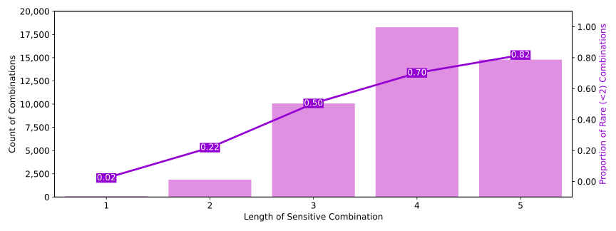

# Synthetic Data Generation Using Yelp Dataset

### Engineering Privacy in Software Course project (Team 8)

## Project Overview

Applying [Microsoft's Synthetic Data Showcase Library](https://github.com/microsoft/synthetic-data-showcase) to achieve
more privacy-preserving way of utilizing user data on [Yelp Dataset](https://www.yelp.com/dataset).

## Project Description

With the increasing concerns around privacy, the sensitive information provided by users and collected by companies has
raised issues regarding data traceability to individuals. This lack of privacy has potential harmful consequences, such
as price discrimination and bias, monetizing users' personal data, monitoring and surveillance.

To address this issue, our team aims to study ways to reduce the likelihood of personal information being traced back to
individuals. We will be undertaking a project that utilizes Microsoft's open source Synthetic Data Showcase tool to
generate artificial dataset based on the original dataset to enhance privacy when sharing or analyzing user data.

Specifically, we will be utilizing the Yelp dataset provided by Yelp Inc. for our project. This dataset is a subset of
Yelp’s businesses, reviews, and user data for use in personal, educational, and academic purposes.

## Contributions

By applying Yelp's dataset on Microsoft's Synthetic Data Showcase library, we have successfully provided an artificial
dataset along with aggregated statistical data which protects user data
through [k-anonymity](https://en.wikipedia.org/wiki/K-anonymity) (a type of privacy-enhancing technology) rather than
releasing the original dataset. Additionally, we developed a user interface for better usability. The privacy-preserving
outcomes generated by this tool is better visualized to the users.

## Set Up Guidance (backend)

Microsoft's Synthetic Data Showcase is based on Rust, and it can be built into Python bindings. Thus, to set up the
backend server you must first install Rust.

### Install Rust

First follow the [steps](https://www.rust-lang.org/tools/install) according to your operating system to install the Rust
tooling.

For macOS, try

```bash
curl --proto '=https' --tlsv1.2 -sSf https://sh.rustup.rs | sh
```

and follow the on-screen instructions.

To verify the installation, try

```bash
cargo --version
```

in the terminal.

### Install Python and Pip

### Create a virtual env

Go to the `backend` folder, create and use a virtual Python env to install dependencies and run the backend server.

```bash
cd backend
python -m venv venv
source venv/bin/activate
```

### Generate the Python bindings

Install _Maturin_ to build the bindings.

```bash
pip install maturin
```

Go to the `lib-python` package, build and install it as a python module in the current virtual environment.

```bash
cd packages/lib-python
maturin develop --release
```

#### Install the dependencies

Go back to the `backend` folder, and install all the required python dependencies.

```bash
cd ../../
pip install -r packages/pythonpipline/requirements.txt
```

### Run the server

Make sure yor are in the `backend` folder, and run the following command:

```bash
venv/bin/python3 manage.py runserver
```

This will use the virtual env to run the Django backend server on http://localhost:8000/

## Input

Users of our application is expected to provide JSON file input to the application. The specific data structure that
needs to be followed can be found [here](https://www.yelp.com/dataset/documentation/main) (user.json).

## Configuration

Users can config the application to tailor to their own needs. We hope to be able to let the users config the
application in the frontend, but currently the users can change the config in backend/service/service.py. The example
config provided in the code is:

```python
config = {
    'parallel_jobs': 1,
    'cache_max_size': 100000,
    'multi_value_columns': {},
    'use_columns': [],
    'record_limit': -1,
    'reporting_length': 5,
    'reporting_resolution': 2,
    'synthesis_mode': 'row_seeded',
    'sensitive_zeros': [],
    'output_dir': output_dir,
    'sensitive_microdata_path': sensitive_microdata_path,
    'sensitive_microdata_delimiter': '\t',
    'report_title': 'Yelp Data Showcase',
    'prefix': 'yelp',
    "aggregate": True,
    "generate": True,
    "navigate": True,
    "evaluate": True
}
```

Here we will introduce some of the important config parameters. The meaning of the other parameters can be
found [here](https://github.com/microsoft/synthetic-data-showcase/blob/main/packages/python-pipeline/README.md).

### synthesis_mode

This parameter is used to specify the different features of Microsoft's Synthetic Data Showcase library. In the example,
we selected the ```row_seeded``` mode, which proceeds by sampling attributes from a sensitive record until the addition
of further attributes would create a rare combination based on the ```reporting_resolution```. These privacy-preserving
subsets of sensitive records are collected for output as synthetic records. The unused attributes of each seed are also
collected, with further output records synthesized from these (without replacement) until all sensitive attributes are
accounted for in a synthetic record. This mode uses the option “suppress” to achieve k-anonymity, and it preserves
statistics for visual analytics and ensures 0% fabrication for all combination lengths.

Other available modes include ```aggregate_seeded```, which can use “fabricated” data to achieve differential privacy,
etc.

### reporting_resolution

This parameter has a similar meaning to the “k” value in the k-anonymity mode described above. It also plays a role in
the aggregation process by rounding the reported aggregate counts down to the closest multiple of the specified
reporting_resolution. Therefore, the ```reporting_resolution``` acts as both the minimum threshold for reporting and the
minimum difference between reported counts.

### reporting_length

This parameter is used to specify the maximum number of attributes that can be combined. This cannot be too large,
otherwise the number of attribute combinations will increase exponentially.

### use_columns

This parameter is used to specify the attributes of interest (an empty list means selecting all attributes).

### sensitive_microdata_path & output_dir

These two parameters are used to specify the input and output paths, respectively.

### aggregate, generate & evaluate

These parameters are used to specify the tasks that need to be performed by Microsoft's Synthetic Data Showcase library.

### parallel_jobs

This parameter is the number of tasks that can be run simultaneously, which can greatly increase the application's speed
depending on the number of CPU the users’ computers have.

## Results

The results can be viewed in our frontend. Also, users can find all the generated files in ```backend/{output_dir}```,
where ```output_dir``` is defined by the users. For example, if the ```output_dir``` is assigned to ```yelp```, then the
results can be found int ```backend/yelp```.

Here we will introduce some of the important results. The meaning of the other results can also be
found [here](https://github.com/microsoft/synthetic-data-showcase/blob/main/packages/python-pipeline/README.md).

### *_synthetic_microdata.tsv

This is the generated synthetic dataset. In the dataset, each row represents personal data of a “user”, and each column
is a value for an attribute of that “user”. If the “row_seeded” mode is used, all values in the generated dataset come
from the original (preprocessed) dataset. Specifically, values are presented in categorical ranges, using the same
partitioning as in the preprocessing step. Additionally, as the “row_seeded” mode achieves k-anonymity using
suppression, the resulting dataset may not have complete rows, but instead may have empty cells (i.e. suppressed data)

### *_reportable_aggregates.tsv / *_reportable_aggregated_data.json

These are reportable aggregate counts from the synthetic dataset. All reportable counts are multiples of K. Furthermore,
the count of each item in the synthetic dataset closely approximates the original value, typically as a multiple of K
that is closest to the original, which indicates that the statistical characteristics of the original dataset are
well-preserved. These are privacy-preserving and can be shared.

### *_sensitive_aggregates.tsv / *_sensitive_aggregated_data.json

These are sensitive aggregate counts from the original dataset. These are considered highly-sensitive and should be
protected in the same way as the original raw data.

### *_sensitive_rare_by_length.svg/tsv

These display the data related to attribute combinations in the original dataset. The horizontal axis of the graph
represents the number of attributes that are combined, while the vertical axis on the left indicates the number of
combinations possible. The right-hand side of the graph displays the percentage of rare combinations, defined as those
occurring less than k times in the original dataset.

Even in cases where an individual’s personally identifiable information is not present in the dataset, they can still be
identified based on the unique combination of attributes. Also, with an increase in the number of attributes combined,
the possibility of rare combinations also increases. Users of our app can use these findings to determine their privacy
budget and adjust their privacy settings accordingly.



## Acknowledgement

We would like to express our gratitude to the following individuals and organizations for their contributions to this
project:

### EPS Team Members

We would like to thank Hongtao Yao, Gianna Jiang, Thanh Nguyen, and Andrew Berry from the EPS team 8 for their valuable
insights, feedback, and technical assistance during the development of this project.

### Microsoft's Synthetic Data Showcase Library

We would also like to
acknowledge [Microsoft's Synthetic Data Showcase Library](https://github.com/microsoft/synthetic-data-showcase) for
providing the synthetic data tool/library used in this project, which greatly facilitated our analysis and
implementation. The code in ```backend/packages``` mostly comes from Microsoft's Synthetic Data Showcase Library.

### Yelp Dataset

Finally, we would like to acknowledge the [Yelp Dataset](https://www.yelp.com/dataset), which served as the primary
source of data for this project. We appreciate the efforts of Yelp in providing this dataset for research purposes, and
we hope our findings contribute to a better understanding of the restaurant industry.

Thanks to everyone who contributed to the success of this project.